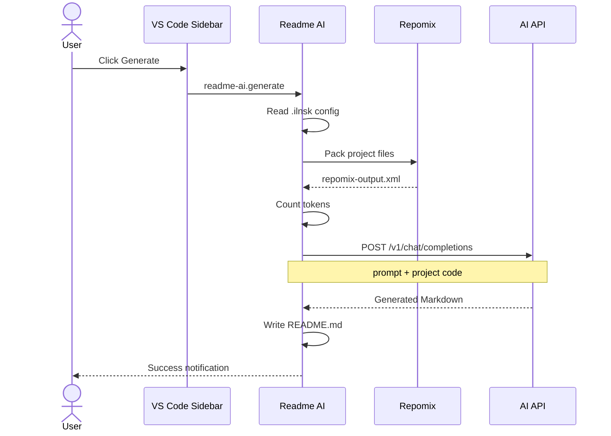

# Readme AI

> AI-powered README generator for VS Code. Analyzes your project code and generates professional documentation using any OpenAI-compatible LLM.


---

## 📖 Overview

**Readme AI** is a VS Code extension that automates README generation. It uses [Repomix](https://github.com/yamadashy/repomix) to compress your project into a single file, counts tokens for cost estimation, and sends everything to any OpenAI-compatible API to produce a polished `README.md`.

The extension is designed for developers who want to maintain quality documentation without spending hours writing it manually.

## ✨ Features

- 📦 **Automated project packing** — compresses repository into a single XML file using Repomix
- 🤖 **AI-powered generation** — sends code to any OpenAI-compatible LLM (OpenAI, Qwen, local models)
- 🔢 **Token counting** — built-in estimation with Qwen Chinese character optimization
- ⚙️ **Smart configuration** — auto-creates `.ilnsk` and `repomix.config.json` with AI-suggested ignore patterns
- 📝 **Custom prompts** — edit AI instructions directly in VS Code via the sidebar
- 🎯 **One-click generation** — generate README from the sidebar tree view

## 🛠️ Tech Stack


| Layer | Technology |
|-------|-----------|
| Language | TypeScript 5.0 |
| Runtime | Node.js 18+ |
| Packaging | Repomix 0.2 |
| AI API | OpenAI-compatible (`/v1/chat/completions`) |
| Extension | VS Code 1.115+ |

## 🚀 Installation

### Prerequisites

- VS Code 1.115.0 or higher
- Node.js 18+
- API key for an OpenAI-compatible LLM

### From source

```bash
git clone https://github.com/DemonDis/readme-ai.git
cd readme-ai
npm install
npm run compile
npm run package
```

Install the generated `.vsix` via VS Code: `Extensions → ... → Install from VSIX`.

### Development mode

```bash
npm install
npm run compile
# Press F5 to launch extension development host
```

## 💡 Usage

1. Open your project in VS Code
2. Click the **Readme AI** icon in the sidebar
3. Click **Setup** — creates `.ilnsk` config file
4. Fill in your API URL, key, and model in `.ilnsk`
5. Click **Setup** again to generate Repomix config (optionally with AI)
6. Expand **Generate** and select a prompt template
7. The extension produces a ready-to-use `README.md`

```json
// .ilnsk
{
  "apiUrl": "https://api.openai.com/v1",
  "apiKey": "sk-...",
  "model": "gpt-4-turbo"
}
```

## 📁 Project Structure

```
readme-ai/
├── src/
│   ├── commands/          # VS Code command handlers
│   │   ├── setup.ts       # Project setup & config generation
│   │   ├── generate.ts    # README generation pipeline
│   │   ├── update.ts      # README update (WIP)
│   │   └── editPrompt.ts  # Edit prompt templates
│   ├── config/            # Default configurations
│   │   ├── types.ts       # .ilnsk config interface
│   │   ├── repomix.ts     # Repomix defaults
│   │   └── tree.ts        # Tree exclude patterns
│   ├── prompts/           # AI prompt templates (Markdown)
│   │   ├── readme.md      # README generation prompt
│   │   └── api.md         # API documentation prompt
│   ├── services/          # Core business logic
│   │   ├── ai.ts          # LLM API client
│   │   ├── config.ts      # Config file I/O
│   │   ├── repomix.ts     # Repomix wrapper
│   │   └── token.ts       # Token counter
│   ├── ui/
│   │   └── provider.ts    # Sidebar tree view
│   └── extension.ts       # Extension entry point
├── package.json
├── tsconfig.json
└── README.md
```

## 🏗️ Architecture



## ⚙️ Configuration

### `.ilnsk` (required)

Created automatically in the workspace root on first Setup run.

| Field | Type | Description |
|-------|------|-------------|
| `apiUrl` | string | OpenAI-compatible API endpoint |
| `apiKey` | string | API authentication key |
| `model` | string | Model identifier (e.g. `gpt-4-turbo`) |
| `prompt` | string | Optional custom prompt override |

### `repomix.config.json`

Generated automatically. Controls file inclusion/exclusion patterns for project packing.

## 🧪 Development

```bash
npm run compile    # Compile TypeScript
npm run watch      # Watch mode
npm run package    # Build .vsix
```

## 🤝 Contributing

1. Fork the repository
2. Create a feature branch (`git checkout -b feature/amazing-feature`)
3. Commit your changes (`git commit -m 'Add amazing feature'`)
4. Push to the branch (`git push origin feature/amazing-feature`)
5. Open a Pull Request

## 📄 License

Distributed under the MIT License. See `LICENSE` for more information.
