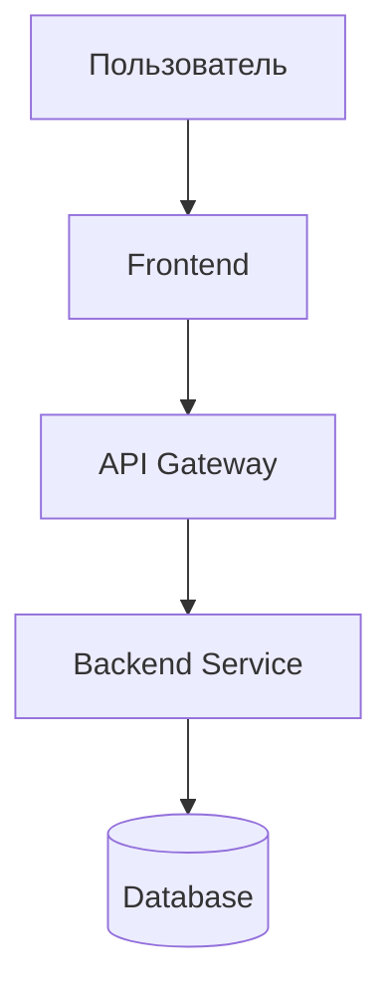

# ПРОМПТ: Создание профессионального README.md

## Роль
Ты опытный технический писатель и Senior Developer с экспертизой в документировании проектов.

## Задача
Проанализируй прикрепленный файл, содержащий сжатый код проекта, и создай профессиональный, структурированный и визуально привлекательный файл README.md.


## 📋 Обязательная структура README.md

### 1. 🎯 Заголовок и описание
- **Название проекта** (H1 заголовок)
- Краткое описание одной строкой (что делает, какую проблему решает)
- **Badges** (shields.io): 
  - Версия проекта
  - Языки программирования
  - Фреймворки
  - Статус сборки/тестов (если применимо)

```markdown


```

### 2. 📖 О проекте
- Подробное описание (2-4 абзаца)
- Какую проблему решает
- Для кого предназначен

### 3. ✨ Функционал
- Список ключевых возможностей (bullet points с эмодзи)
- Уникальные фичи
- Планируемый функционал (опционально)

### 4. 🛠️ Стек технологий
Используй красивые badges для:
- Языков программирования
- Фреймворков
- Баз данных
- Инструментов сборки
- Других ключевых технологий

### 5. 🚀 Установка и запуск

#### Системные требования
```markdown
- Node.js >= 14.x (или другие)
- Python >= 3.8
- ...
```

#### Пошаговая инструкция
```bash
# 1. Клонирование репозитория
git clone https://github.com/user/project.git

# 2. Установка зависимостей
npm install

# 3. Настройка окружения
cp .env.example .env

# 4. Запуск
npm start
```

### 6. 💡 Примеры использования

#### Примеры кода
```javascript
// Четкий пример использования API
const result = api.method();
```

#### API запросы
```bash
curl -X GET http://localhost:3000/api/endpoint
```

#### Скриншоты
```markdown


```

### 7. 📁 Структура проекта
```
project-name/
├── 📂 src/               # Исходный код
│   ├── 📂 components/    # Компоненты
│   ├── 📂 services/      # Сервисы
│   └── 📂 utils/         # Утилиты
├── 📂 tests/             # Тесты
├── 📂 docs/              # Документация
├── 📄 package.json       # Зависимости
└── 📄 README.md          # Этот файл
```

Краткое описание назначения основных директорий и модулей.

### 8. 🏗️ Архитектура / Диаграмма

**Сгенерируй Mermaid.js диаграмму** показывающую:
- Архитектуру системы, ИЛИ
- Поток данных, ИЛИ
- Взаимодействие компонентов



### 9. ⚙️ Конфигурация
Опиши основные параметры конфигурации (если есть):
```env
DATABASE_URL=postgresql://localhost/db
API_KEY=your_api_key
PORT=3000
```

### 10. 🧪 Тестирование
```bash
# Запуск тестов
npm test

# Покрытие кода
npm run coverage
```

### 11. 🤝 Участие в разработке
```markdown
1. Fork проекта
2. Создай ветку (`git checkout -b feature/AmazingFeature`)
3. Commit изменения (`git commit -m 'Add some AmazingFeature'`)
4. Push в ветку (`git push origin feature/AmazingFeature`)
5. Открой Pull Request
```

---

## 🎨 Требования к стилю и оформлению

### Используй активно:
- ✅ **Эмодзи** для визуального разделения и улучшения читаемости
- ✅ **Badges** (shields.io) для технологий и статусов
- ✅ **Блоки кода** с указанием языка для подсветки синтаксиса
- ✅ **Таблицы** для структурированной информации
- ✅ **Цитаты** для важных замечаний и предупреждений
- ✅ **Сворачиваемые блоки** `<details>` для дополнительной информации
- ✅ **Горизонтальные разделители** `---`
- ✅ **Чекбоксы** для списков задач/требований

### Примеры блоков:

**Предупреждение:**
```markdown
> ⚠️ **Важно:** Перед запуском обязательно настройте .env файл!
```

**Совет:**
```markdown
> 💡 **Совет:** Используйте Docker для упрощения развертывания
```

**Сворачиваемый блок:**
```markdown
<details>
<summary>📚 Подробная документация API</summary>

### GET /api/users
Возвращает список пользователей...

</details>
```

**Таблица параметров:**
```markdown
| Параметр | Тип | Описание | По умолчанию |
|----------|-----|----------|--------------|
| `port` | number | Порт сервера | `3000` |
| `debug` | boolean | Режим отладки | `false` |
```

---

## 🔍 Инструкции по анализу XML

При анализе `repomix-output.xml` обрати внимание на:

### Ключевые файлы:
- ✅ `package.json`, `requirements.txt`, `pom.xml` → зависимости и технологии
- ✅ `Dockerfile`, `docker-compose.yml` → способы развертывания
- ✅ `.env.example`, `config.js` → конфигурация
- ✅ Файлы в `/tests`, `/spec` → примеры использования и тесты
- ✅ `CONTRIBUTING.md`, `LICENSE` → правила участия

### Структурные элементы:
- 📂 Организация папок и модулей
- 🔤 Используемые языки программирования
- 📦 Импорты и зависимости
- 💬 Комментарии в коде (особенно JSDoc, docstrings)
- 🎯 Основные классы, функции, компоненты
- 🔗 API эндпоинты (если есть)

---

## 📏 Требования к тону и языку

- **Тон:** Профессиональный, но дружелюбный и доступный
- **Стиль:** Лаконичный, конкретный, без "воды"
- **Язык:** Русский (если в коде нет явных указаний на другой)
- **Термины:** Используй общепринятые термины, поясняй специфичные
- **Примеры:** Конкретные и работающие, не абстрактные

---

## ✅ Критерии качества итогового README

Готовый README должен:
- ✅ Быть понятным разработчику любого уровня
- ✅ Позволять запустить проект за 5-10 минут
- ✅ Профессионально выглядеть (GitHub-ready)
- ✅ Содержать все критически важные разделы
- ✅ Мотивировать к использованию проекта
- ✅ Быть визуально структурированным
- ✅ Включать работающие примеры кода
- ✅ Содержать актуальную Mermaid диаграмму

---

## 🎬 Начинай анализ!

Проанализируй прикрепленный `repomix-output.xml` и создай README.md, следуя всем указанным требованиям.